项目环境：jdk1.8，maven3.8.5等  
前端库：jquery,layui,zTree等  
程序主要用于html类型文档的翻译、修正、生成离线文件  
当前有文档：jcef-api(已修正)，poi-5.0-api(未修正)，poi-5.0-官方文档（部分做了修正）  

如何启动项目
=
下载或导出项目后，先去 bin\win64 下解压二进制文件，解压时请选择“解压到当前文件夹”(dll文件解压后在win64目录下，git上传不了大文件，所以打成了几个压缩包)  
此项目为maven项目。eclipse请使用maven项目的方式引入。  
理论上使用JDK1.8直接运行 com.xuanyimao.translate.StartupApp 即可。如果出现找不到二进制库的错误，可能需要手动引入二进制库。  
使用了jcefmaven库( https://github.com/jcefmaven/jcefmaven )，这里面包含了所需的jar，但是仅仅是使用了它的jar包。根据官方文档的介绍，进行配置后，首次启动会自动下载所需的二进制库。我试了下启动报错，就用了另外的方式。  
使用了jcefbuild库( https://github.com/jcefmaven/jcefbuild/releases )，这里有官方构建好的二进制文件。这个库的文件放在 bin/win64 目录下，在启动类中通过反射的方式动态载入。这种方式与jvm耦合，请参考 https://blog.csdn.net/cruise_h/article/details/41575481 。   
  
如何打包  
=
执行maven的打包指令即可(eclipse和idea都有支持)，打包了view和bin目录。  
jar包生成在项目根目录的jar目录中(不是target目录下的)。使用 java -jar xym-translate-jcef.jar 运行  
程序运行时会先检测bin和view目录是否存在，如果不存在，则会创建目录，并从jar包中复制文件到这两个目录    
如果不是在jdk1.8的环境下运行，需要指定二进制文件的目录  

目录结构
=
bin：存放jcef的二进制包，会在打包时一起打进jar包
view：前端视图页面。使用jquery,layui,zTree等  
files：分为data和program两个目录。data目录下存放翻译用到的文件(项目和版本的配置文件也存放在这里)。program目录下存放修正、生成离线文件用到的文件。  
src：java代码
jar：执行maven打包后创建，生成的jar包可直接运行。  
log：运行jar文件后生成的日志目录
cache：程序的缓存文件目录(jcef的缓存数据)

如何翻译  
-
软件主界面分为“项目”和“版本”两部分。下面以创建POI（一个用于word、excel操作的库） API文档翻译程序做例子。  
首先，新建项目“POI”，再新建子项“api文档”。因为一个库可能会有多种文档，所以在这里做一下分类。  
然后，点击新建的子项“api文档”，在右侧的版本列表框中点击“新建版本”按钮，填写版本号，“翻译程序”选择“API文档通用翻译程序”，点击“保存”  
项目名、版本名随意命名，只是为了自己查看方便。“翻译程序”才是翻译用到的东西。不同的HTML文档结构不一样，需要自行编写文档解析程序。  
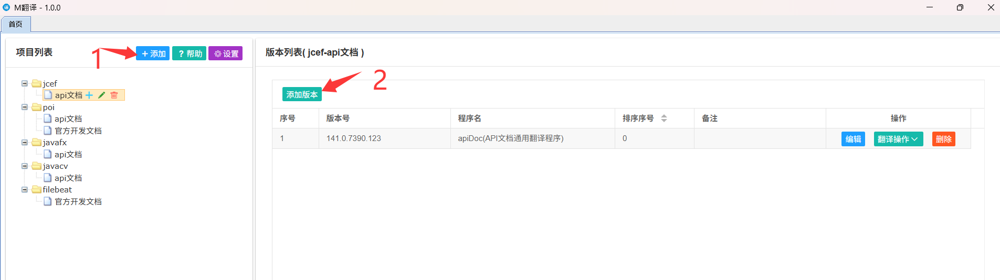  
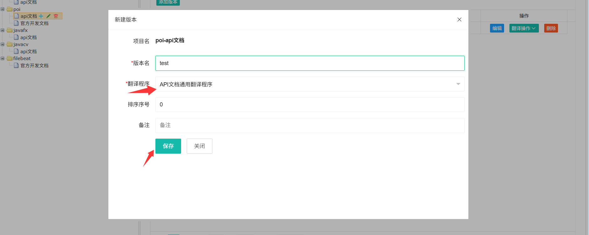  
  
在翻译之前，还得点击首页的紫色“配置”按钮，配置翻译平台的KEY，目前只支持腾讯和百度。  
腾讯可以申请免费500万字符额度，百度只有100万，腾讯的机器翻译能力要弱一些。(额度可能随时会调整，百度这厮已经调整几次了)  
百度翻译KEY申请地址： https://fanyi-api.baidu.com/product/112  
腾讯翻译KEY申请地址： https://console.cloud.tencent.com/cam/capi (腾讯除了申请key，还需要开通翻译的产品服务)
使用翻译平台的免费额度，请注意不要使用超量。到90%就停下来  

接下来在版本列表，点击“翻译操作”按钮，选择“翻译”，进入翻译程序页面  
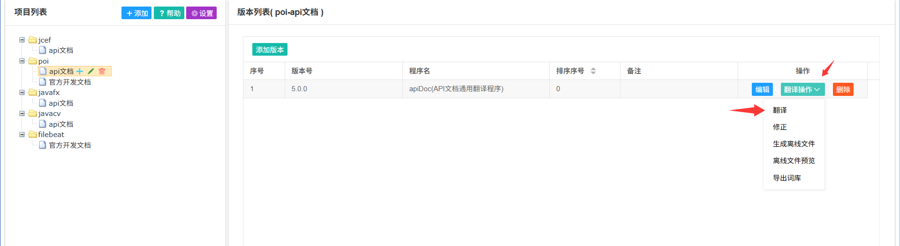  

首次进入翻译程序页面会弹出“初始化”窗口，选择您要翻译的 api文档 的目录(到文档的根目录就行),点击“初始化”按钮  
选错了没关系，可以点“重新初始化”按钮再次操作  
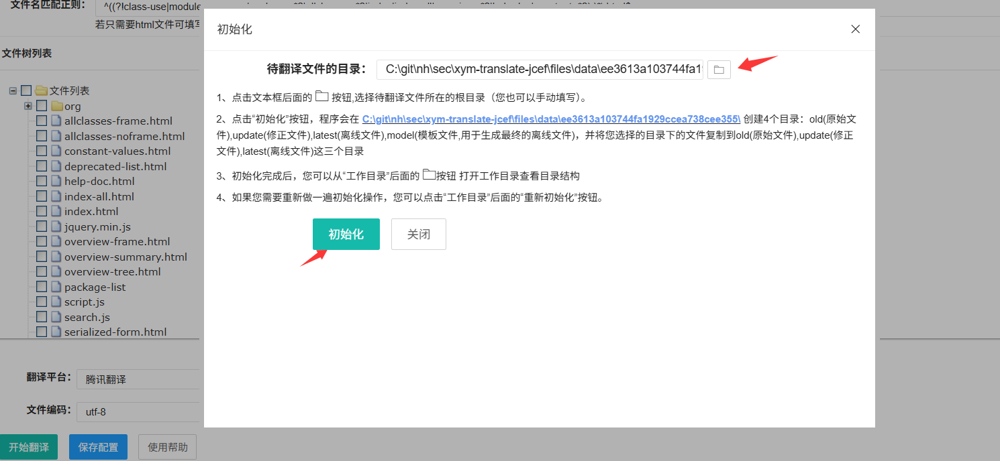

翻译配置界面，“词库”是可选的。词库 主要用于对已翻译的语句进行重复利用，减少与翻译平台的交互次数，提升翻译速度  
词库是一个缓存在内存中的Map数据块，格式为{"原文":"译文"……}。  
程序进行翻译时，会先到这个缓存中查找是否有与当前翻译的语句匹配的数据，如果有，就拿缓存中的译文，如果没有，就调用翻译平台进行翻译  
当你对一个文档进行翻译后，可以使用首页“版本列表”表格中的“导出词库”功能导出一个文本文件。在另一台机器上翻译相同的文档时，选择这个词库，点击“开始翻译”，则可以不调用翻译平台完成翻译。  
众所周知，第三方库更新版本时，通常只会有些许修改（像jcef这么多年，更新的东西也不多）。在翻译新版本时，我们选择旧版本做词库，则可以节约大量翻译平台的免费额度。  
  
“文件名匹配正则”是一个过滤用于翻译的文件的正则表达式。嫌麻烦就配置一个 \.*?html，把所有html文件塞进去，不符合程序规则的反正不会处理。  
  
在翻译开始时，建议先选择一个文件做下测试，处理正常了再全量翻译。  
重复翻译文件没什么问题，拿的是词库缓存的数据。  
翻译开始后，可以手动停止，翻译如果出错了，按钮下方会有提示  
  
  
修正译文  
-
翻译完成后，回到首页，进行修正(不修正也没什么问题，将就着看，意思大差不差)  
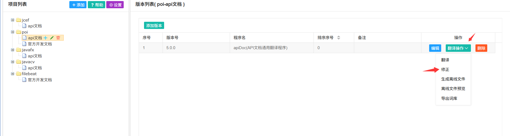  
  
修正页面呈现中英文，英文是黑色，中文是绿色。  
如果您觉得哪段文字有问题，点击修正按钮。修正完后点击“保存”即可。  
“替换其他位置相同译文”用于替换重复出现的语句  
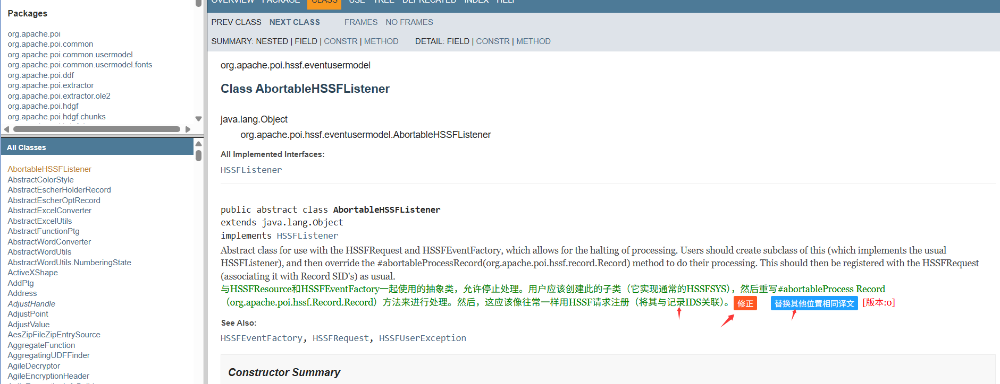  
  
  
生成离线文件
-
修正完后可以生成离线文件。离线文件是一个完整的html包，不依赖软件环境，您可以放到其他电脑或者服务器上打开阅览。  
离线文件提供 “中文”，“英文”，“中英文” 三种模式切换  
选择要生成的离线文件，点击“生成离线文件”按钮，生成完成后，可以导出离线包，或者预览  
“创建搜索框”是API文档特有，用于在API文档左侧的列表框生成一个搜索框，只要执行一次  
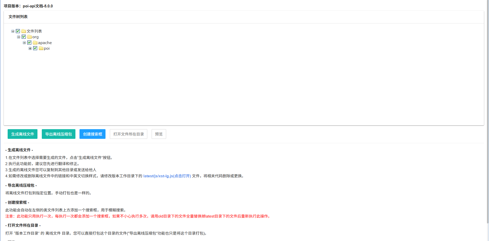  
  
离线文档页面，点击右上角语言模式进行切换
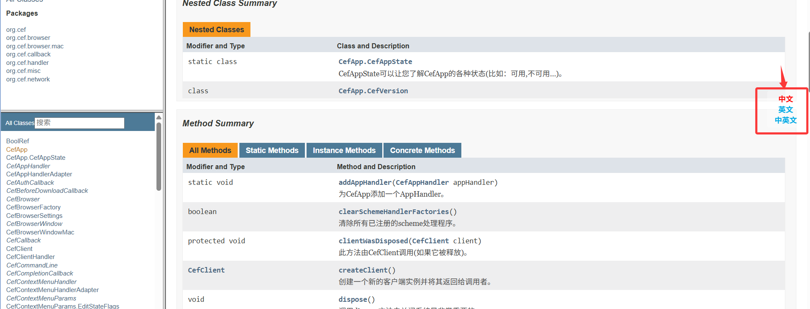  
  
二次开发  
=
增加一个翻译平台
-
在com.xuanyimao.translate.core.translateplatform下新增一个类，实现 TranslatePlatform 接口，再加上 @TranslatePlatformClass 注解。  
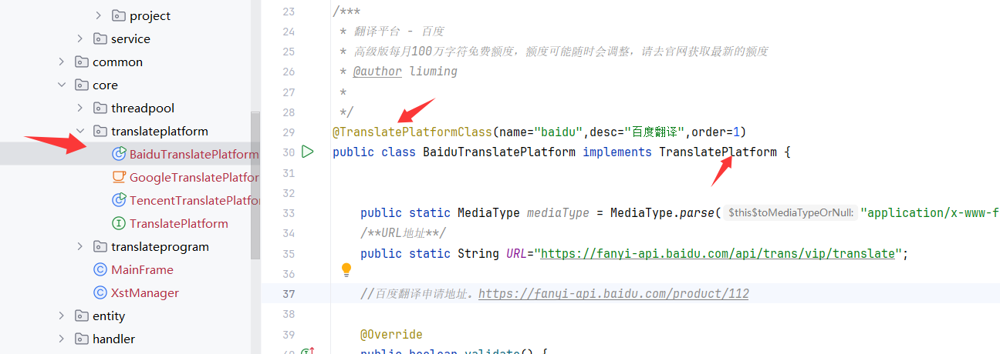

增加一个翻译程序
-
不同的文档需要不同的处理程序，比如说新增一个POI的帮助文档处理程序。
在 com.xuanyimao.translate.core.translateprogram.program 新建 PoiTranslateProgram 类。  
继承 HtmlDocTranslateProgram ，如果继承 HtmlDocTranslateProgram 不能满足您的需求，可参照 HtmlDocTranslateProgram 重写。通常来说，继承这个类可以处理许多类型的html文档。  
需要重写 parseData(data) 方法，这个方法传入了html文件的内容。  
再这个方法里面，使用jsoup(用法和jquery差不多)处理html元素，并将需要翻译的文本内容 设置到 DocElement 对象中。  
DocElement 保存着初始元素的引用、原文、离线页面模板元素、修正页面元素。离线页面模板元素 和 修正页面元素会写入到相应的离线文件页面和修正页面，这两中页面的内容都是由初始页面生成的，所以，生成修正页面，实际上就是将初始页面复制到修正用的目录(update)，然后用 修正页面元素 替换掉 这个对象中的 初始元素引用。  
通常是在 updateDocElement 方法中设置 修正页面元素 和 离线页面模板元素。这个方法在 每条语句翻译后 执行一次，因为这时生成了翻译数据的相关信息，可以写入到修正用的页面。  
  
另外，还需要设置 startTranslatePage()[翻译程序页面]，updateTranslatePage()[修正程序页面],createLatestPage()[生成离线文件页面],viewLatestPage()[离线文件预览页面]这四个方法  
通常情况下，使用公共的 baseHtmlxxx.html 即可，也可以指向您自定义的页面。比如 api文档 生成离线文件多了个 创建搜索框 按钮，这个页面就单独写了一个  
  
  
编写一个java和js交互的接口
-
前端文件在view目录下。js目录下，以Api.js结尾的就是api接口调用程序  
因为jcef中js处理的结果是异步回调的，所以这里用到了Promise，具体查看 common.js 中的 execJava函数   
在 Api.js 结尾的文件中，统一调用了execJava这个函数请求java程序。  
execJava函数传递两个参数，一个是java程序名，一个是参数。具体处理程序请查阅 XstCefMessageRouterHandler   
java程序名 由类注解 @JsClass 的 prefix 属性 加上 方法注解@JsFunction 的 name 属性组成，参数就是方法的参数  
以下为一个简单的示例  
在 com.xuanyimao.translate.api.controller.common 包下新建一个CommonController类，加上注解 @JsClass(prefix="common")。  
在类中写一个方法 fileDialog ，加上 @JsFunction(name="fileDialog") 注解(可以不写name，默认的name是方法名)。  
您便可以在前端使用 execJava("common.fileDialog",{}) 去调用它  
另外，您也可以用 @JsClass 和 @JsObject 注解为属性注入值。参考 BaseHtmlDocController ，有点像写后端接口  
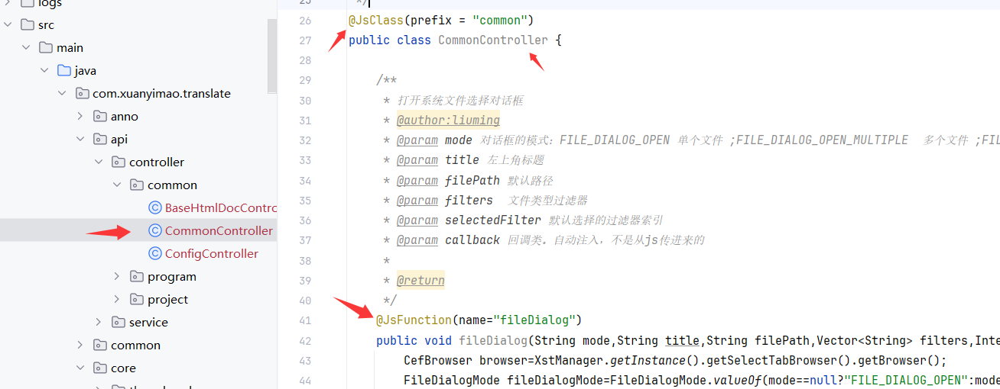  

页面样式调整和js报错查看
-
右键菜单有项“开发者工具”，会弹出谷歌浏览器的开发者工具(jcef带的)，虽然不是很方便，但是够用了  
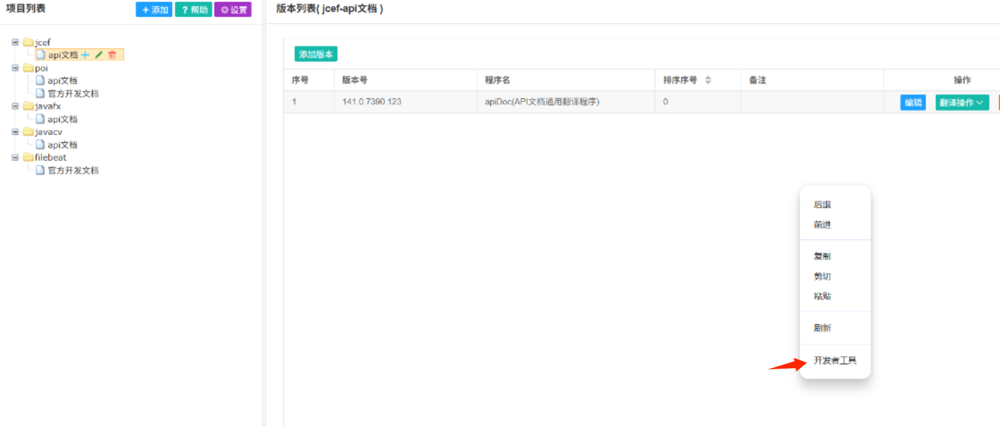  

